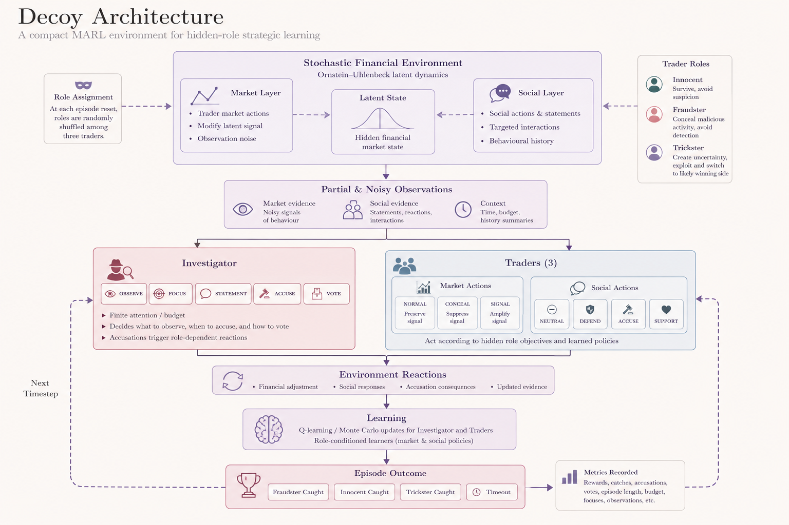
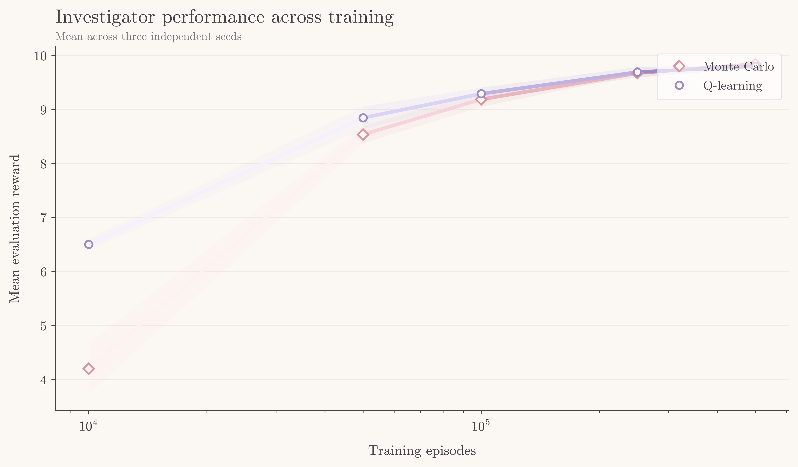
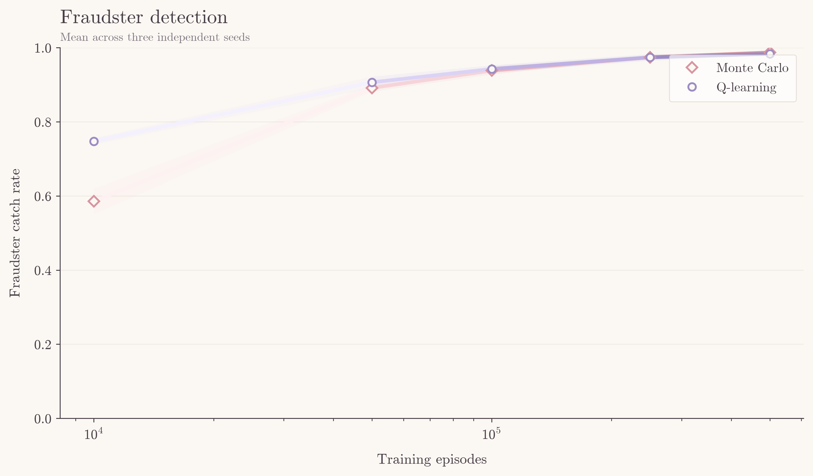
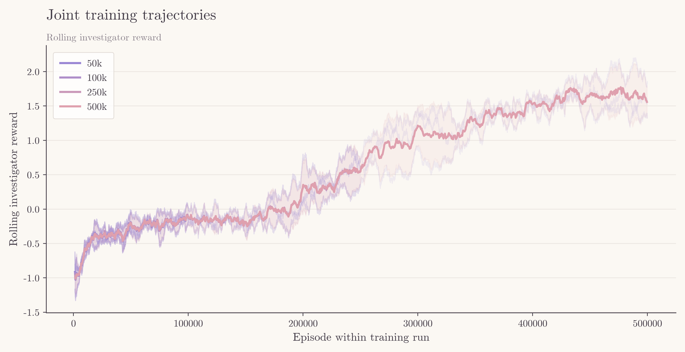
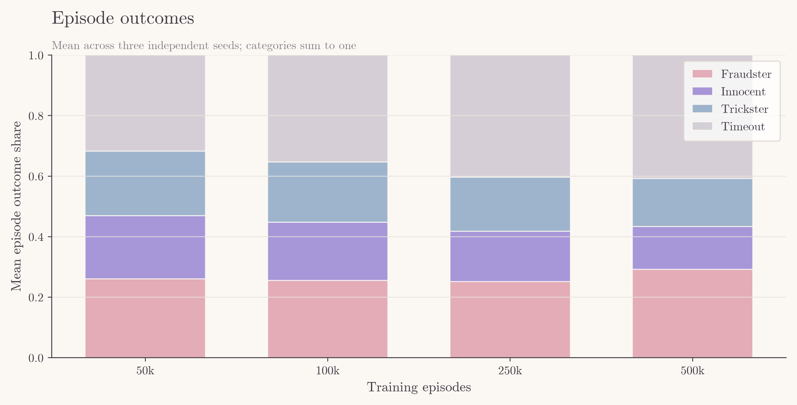

# Decoy 

> A compact, interpretable multi-agent reinforcement-learning environment for hidden-role strategic learning under noisy financial observations and socially reactive behaviour.

## Storyline

A certain company's stock was going up the graph for a long time, making people buy it. However, one morning they woke up to their worst nightmare. The stock drops, then drops a little more, and on until it reaches a point that they've amassed a huge loss. What happened? *There's a financial fraud in the city.*

The police have hired an investigator to find out who caused this mess before they cause more disruption in the market.

## What This Models

Decoy is a small controlled MARL environment built around a hidden-role financial/social-deduction game. Four agents participate: an **Investigator**, **Innocent**, **Fraudster**, and **Trickster**. The Investigator cannot directly observe trader roles and instead reasons from noisy financial observations, social behaviour and a finite investigation budget.

The environment combines partial observability, stochastic financial dynamics, strategic deception and social interaction. Market dynamics use an Ornstein-Uhlenbeck process, while agents learn through tabular Q-learning and Monte Carlo methods. Joint training produces the non-stationarity expected from MARL.

## The Agents

The **Investigator** identifies the Fraudster while deciding when to observe, focus, accuse and vote. The **Innocent** provides a non-malicious baseline. The **Fraudster** attempts to avoid detection. The **Trickster** adds another strategically reactive role and is analysed through a historical win-register signal.

## Architecture



That hopefully summarizes the current state of the architecture.

## Results

### RL: Investigator learning

The first experiment isolates the Investigator and compares **tabular Q-learning** against **Monte Carlo** across increasing training budgets. Each budget was evaluated across three independent seeds.

| Training episodes | Q-learning reward | Monte Carlo reward | Q-learning Fraudster catch | MC Fraudster catch | Q-learning timeout | MC timeout |
|---:|---:|---:|---:|---:|---:|---:|
| 10k | 6.505 | 4.203 | 0.748 | 0.586 | 0.121 | 0.186 |
| 50k | 8.849 | 8.541 | 0.907 | 0.892 | 0.067 | 0.059 |
| 100k | 9.295 | 9.191 | 0.943 | 0.939 | 0.043 | 0.036 |
| 250k | 9.695 | 9.677 | 0.974 | 0.975 | 0.021 | 0.019 |
| 500k | 9.807 | 9.844 | 0.984 | 0.987 | 0.014 | 0.009 |

Both methods learn the investigation task strongly as training increases. Q-learning has the advantage at the earlier budgets, while Monte Carlo catches up by 500k episodes. Fraudster detection approaches 1.0 for both methods while timeout becomes increasingly rare.





### MARL: Joint learning

The second experiment allows the Investigator and all trader learners to adapt simultaneously. Four training budgets were evaluated using three independent seeds each. Unlike the isolated RL experiment, the opposing agents are changing their policies during training, so the effective environment is non-stationary.

| Training episodes | Investigator reward | Fraudster catch | Innocent catch | Trickster catch | Timeout | Episode length |
|---:|---:|---:|---:|---:|---:|---:|
| 50k | -0.448 | 0.260 | 0.209 | 0.214 | 0.317 | 8.768 |
| 100k | -0.326 | 0.255 | 0.193 | 0.199 | 0.353 | 9.185 |
| 250k | -0.082 | 0.252 | 0.166 | 0.178 | 0.404 | 9.726 |
| 500k | 0.629 | 0.292 | 0.141 | 0.159 | 0.408 | 9.871 |

The Investigator is learning, with its average reward improving substantially over training. However, this does not translate into clean game resolution. Fraudster detection remains low, while timeout rate and episode length increase. The Investigator is therefore learning inside an environment where the other agents are simultaneously adapting.





| Experiment | Budgets | Seeds |
|---|---|---:|
| RL-only | 50k / 100k / 250k / 500k | 3 |
| Joint MARL | 50k / 100k / 250k / 500k | 3 |

## Key Characteristics

- **Information asymmetry:** The agents do not operate with the same information. The Investigator must infer hidden roles from observable financial and social behaviour, while the trader learners operate with their own role-specific information and objectives.

- **Partial observability:** The Investigator receives noisy and incomplete observations rather than the underlying hidden state.

- **Non-stationarity:** During joint training, the trader policies change alongside the Investigator's policy, continuously changing the effective environment.

- **Reactive evidence:** Accusations can trigger financial and social reactions, meaning that an Investigator action can change the evidence available in later steps.

- **Resource-constrained investigation:** The Investigator has a finite budget and must balance information gathering against committing to an accusation or vote.

- **Emergent behaviour:** Market and social strategies are learned through repeated interaction rather than being manually scripted.

## Additional MARL Features

The main architecture describes the environment and learning loop, but several mechanisms are used to make the multi-agent setting more adaptive.

- **Independent role-specific learners:** Each trader role has its own learning behaviour rather than sharing a single policy. The market and social action spaces are handled separately, giving the Innocent, Fraudster and Trickster distinct learning processes.

- **Adaptive exploration:** Epsilon can change during training rather than remaining fixed. This allows agents to move from broader exploration toward more exploitation as training progresses.

- **Adaptive investigator alpha:** The Investigator also supports an adaptive learning rate, allowing the magnitude of Q-value updates to change during training. This was evaluated separately as a diagnostic rather than being presented as a guaranteed performance improvement.

- **Legal-action masking:** The Investigator's available actions are restricted according to the current state, preventing invalid actions from being selected during learning.

- **Role-blind trader observations:** Traders do not receive their role as part of their observation. Their behaviour therefore has to emerge from their role-specific objective and learning process rather than from directly exposing the hidden-role label.

- **Accusation-triggered reactions:** An Investigator accusation does not simply end the interaction. It can produce role-dependent financial and social reactions, creating new evidence for subsequent decisions.

- **Trickster WinRegister:** The Trickster maintains a lightweight history of previous outcomes and uses accumulated and recent win information to estimate which side is currently more likely to win. This influences its later social commitment behaviour.

- **Separate market and social learning:** Trader market actions and social actions are learned through separate action structures. Market actions include `NORMAL`, `CONCEAL` and `SIGNAL`, while social actions include `NEUTRAL`, `DEFEND`, `ACCUSE` and `SUPPORT`.

- **Independent random streams:** Multi-agent training uses separate RNG streams for the environment, Investigator, market learners and social learners. This keeps the components reproducible without forcing them to share one random stream.


Together, these mechanisms make the environment more than a fixed-agent RL benchmark. The agents can change how they explore, update their policies, react to accusations and use historical information while interacting with one another.

## Repository

```
Decoy/
│
├── README.md
├── arch.png
├── requirements.txt
├── pytest.ini
├── LICENSE
├── decoy/
│  ├── agent.py
│  ├── environment.py
│  ├── episode.py
│  ├── monte_carlo.py
│  ├──  multi_runner.py
│  ├──  multi_training.py
│  ├──  ou_process.py
│  ├──  q_learning.py
│  ├──  runner.py
│  ├── toy_env.py
│  ├──  training.py
│  ├──  win_register.py
│
├── experiments/
│   ├── compare_rl.py
│   ├── test_env.py
│   ├── test_mc.py
│   ├── test_rl.py
│   ├── train_mc.py
│   ├── train_multi.py
│   ├── train_q.py
│   │
│   └── analysis/
│       ├── check_adaptive_alpha.py
│       ├── plot_multi.py
│       ├── plot_rl.py
│       ├── run_multi_sweep.py
│       ├── run_rl_sweep.py
│       ├── style.py
│       │
│       └── results/
│           ├── multi_summary.csv
│           ├── rl_learning_curve.csv
│           └── trickster_register.csv
│
├── tests/
│   ├── test_environment.py
│   ├── test_monte_carlo.py
│   ├── test_multi_runner.py
│   ├── test_multi_training.py
│   ├── test_ou.py
│   ├── test_q_learning.py
│   ├── test_runner.py
│   ├── test_training.py
│   └── test_win_register.py
│
├── figures/
│
└── multifigures/
```

## Small Literature / Learning Note

A few resources I used while building and understanding Decoy:

- **Reinforcement Learning:** I used the University of Alberta RL material and [RL Theory](https://rltheory.github.io/) to study the foundations behind MDPs, value-based learning, exploration and learning dynamics.

- **Stochastic Processes:** For the financial dynamics, I studied the Ornstein-Uhlenbeck process, particularly its mean-reverting behaviour and stochastic formulation, using [this study guide](https://fiveable.me/stochastic-processes/unit-9/ornstein-uhlenbeck-process/study-guide/A63hHvOtp6DrjQST).

These were learning references for building the environment, not intended as a formal literature review.

## Limitations

Decoy is deliberately small. The Investigator currently has limited reasoning capacity, the financial dynamics are simplified, and the learning is tabular. The goal is not to solve deception or MARL, but to provide a controlled environment where learning dynamics can be inspected.`multi_learning_curve.csv` couldn't be added since the file is too big.

## Future Scope

The current version deliberately keeps the Investigator relatively simple. The MARL results suggest several natural directions:

- Give the Investigator a richer state representation and stronger evidence aggregation.
- Introduce explicit opponent modelling or belief-state reasoning.
- Study richer communication and social inference.
- Replace the current lightweight Trickster register with a learned strategic model.
- Explore stronger MARL approaches such as CTDE and centralized critics.
- Investigate larger state/action spaces and neural function approximation.
- Add further fixed-vs-learned and frozen-vs-learned opponent evaluations.
- Extend the environment with additional roles and more complex financial dynamics.

## Credits
ChatGPT for the graph and image designs. 
